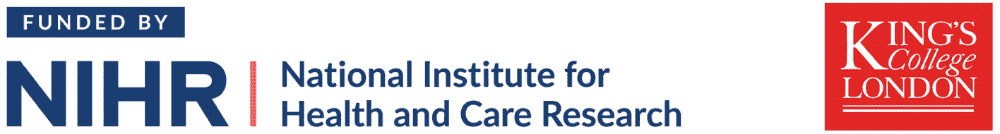

<!-- README.md is generated from README.Rmd. Please edit that file -->

```{r, include = FALSE}
knitr::opts_chunk$set(
  collapse = TRUE,
  comment = "#>",
  out.width = "100%"
)
```

# pmsims: Simulation-based Sample Size Tools for Prediction Models <a href="https://pmsims-package.github.io/pmsims/"></a>

<!-- badges: start -->
<!-- badges: end -->


**pmsims** is an R package for estimating how much data are needed to develop
reliable and generalisable prediction models. It uses a **simulation-based
learning curve** approach to quantify how model performance improves with
increasing sample size, supporting principled study planning and feasibility
assessment.

The package is fully model-agnostic: users can define how data are generated,
how models are fitted, and how predictive performance is measured. It currently
supports regression-based prediction models with continuous, binary, and
time-to-event outcomes.

Developed at [King’s College London](https://www.kcl.ac.uk/) (Department of
Biostatistics & Health Informatics) with input from researchers, clinicians,
and patient partners. See the [pmsims project
site](https://pmsims-package.github.io/pmsims-website/) for further details.

## Installation

Install the development version from GitHub:

```r
# install.packages("remotes")
remotes::install_github("pmsims-package/pmsims")
```

## Minimal example

```r
library(pmsims)
set.seed(123)

binary_example <- simulate_binary(
  signal_parameters = 15,
  noise_parameters  = 0,
  predictor_type = "continuous",
  binary_predictor_prevalence = NULL,
  outcome_prevalence = 0.20,
  large_sample_cstatistic = 0.80,
  model = "glm",
  metric = "calibration_slope",
  minimum_acceptable_performance = 0.90,
  n_reps_total = 1000,
  mean_or_assurance = "assurance"
)

binary_example
```

---

## Get in touch

We welcome questions, suggestions, and collaboration enquiries.

- **Email:** <a href="mailto:pmsims@kcl.ac.uk?subject=pmsims%20enquiry">pmsims@kcl.ac.uk</a>
- **Feedback or bugs:** please <a href="https://github.com/pmsims-package/pmsims/issues">open a GitHub issue</a>

---

## Funding

This work is supported by the **National Institute for Health and Care Research (NIHR)** under the
**Research for Patient Benefit (RfPB)** Programme ([*NIHR206858*](https://www.fundingawards.nihr.ac.uk/award/NIHR206858)).

<p align="center">
  
</p>

*The views expressed are those of the authors and not necessarily those of the NIHR or the Department of Health and Social Care.*
