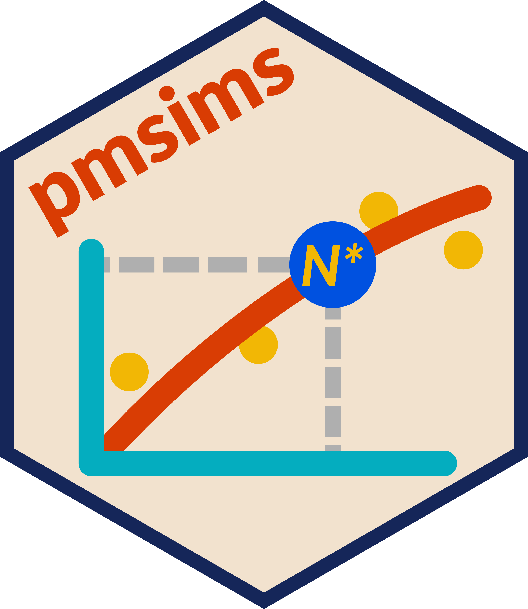

<!-- README.md is generated from README.Rmd. Please edit that file -->

```{r, include = FALSE}
knitr::opts_chunk$set(
  collapse = TRUE,
  comment = "#>",
  out.width = "100%"
)
```

# pmsims: Simulation-based Sample Size Tools for Prediction Models <a href="https://pmsims-package.github.io/pmsims/"></a>

<!-- badges: start -->
[](https://github.com/pmsims-package/pmsims/releases)
[](https://github.com/pmsims-package/pmsims/actions/workflows/R-CMD-check.yaml)
[](https://app.codecov.io/gh/pmsims-package/pmsims)
<!-- badges: end -->


**pmsims** is an R package for estimating how much data are needed to develop
reliable and generalisable prediction models. It uses a **simulation-based
learning curve** approach to quantify how model performance improves with
increasing sample size, supporting principled study planning and feasibility
assessment.

The package is fully model-agnostic: users can define how data are generated,
how models are fitted, and how predictive performance is measured. It currently
supports regression-based prediction models with continuous, binary, and
time-to-event outcomes.

`pmsims` also includes experimental machine-learning model options via
regularised regression, random forest, and XGBoost. These options have not yet undergone the package's main
validation study and should be treated as experimental in `0.5.0`.

Developed at [King’s College London](https://www.kcl.ac.uk/) (Department of
Biostatistics & Health Informatics) with input from researchers, clinicians,
and patient partners. See the [pmsims project
site](https://pmsims-package.github.io/pmsims-website/) for further details.

## Installation

Install the stable `0.5.0` release from GitHub:

```r
# install.packages("remotes")
remotes::install_github("pmsims-package/pmsims", ref = "v0.5.0")
```

If you are interested in trying the development version, install from the
`dev` branch:

```r
# install.packages("remotes")
remotes::install_github("pmsims-package/pmsims", ref = "dev")
```

The development version includes work in progress and may change before the
next tagged release.

## Minimal example

```r
library(pmsims)
set.seed(123)

binary_example <- simulate_binary(
  signal_parameters = 10,
  noise_parameters = 10,
  complexity = 2,
  data_control = list(nonlinear_strength = 0.4, correlation = 0.2),
  outcome_prevalence = 0.20,
  maximum_achievable_cstatistic = 0.75,
  model = "glm",
  metric = "calibration_slope",
  target_performance = 0.90,
  n_reps_total = 1000,
  mean_or_assurance = "assurance"
)

binary_example
```

`maximum_achievable_cstatistic` and `target_performance` have different roles:

- `maximum_achievable_cstatistic` represents the best plausible C-statistic with effectively unlimited data and calibrates the data generator.
- `target_performance` is the minimum acceptable metric value used to determine the required sample size.

---

## Citing pmsims

If you use `pmsims`, please cite the package and either or both
accompanying preprints.

Current preprints:

- Shamsutdinova D, Zimmer F, Olaniran OR, Markham S, Stahl D, Forbes G,
  Carr E (2026). *Sample Size Calculations for Developing Clinical Prediction
  Models: Overview and pmsims R package*. arXiv. <https://arxiv.org/abs/2602.23507>

- Olaniran OR, Shamsutdinova D, Markham S, Zimmer F, Stahl D, Forbes G,
  Carr E (2026). *Adaptive Gaussian Process Search for Simulation-Based
  Sample Size Estimation in Clinical Prediction Models: Validation of the
  pmsims R Package*. arXiv. <https://arxiv.org/abs/2603.23688>

Once peer-reviewed articles are available, these citations should be
updated to the published versions. In R, you can retrieve the package
citation with:

```r
citation("pmsims")
```

---

## Get in touch

We welcome questions, suggestions, and collaboration enquiries.

- **Email:** <a href="mailto:pmsims@kcl.ac.uk?subject=pmsims%20enquiry">pmsims@kcl.ac.uk</a>
- **Feedback or bugs:** please <a href="https://github.com/pmsims-package/pmsims/issues">open a GitHub issue</a>

---

## Funding

This work is supported by the **National Institute for Health and Care Research (NIHR)** under the
**Research for Patient Benefit (RfPB)** Programme ([*NIHR206858*](https://www.fundingawards.nihr.ac.uk/award/NIHR206858)).

<p align="center">
  
</p>

*The views expressed are those of the authors and not necessarily those of the NIHR or the Department of Health and Social Care.*
