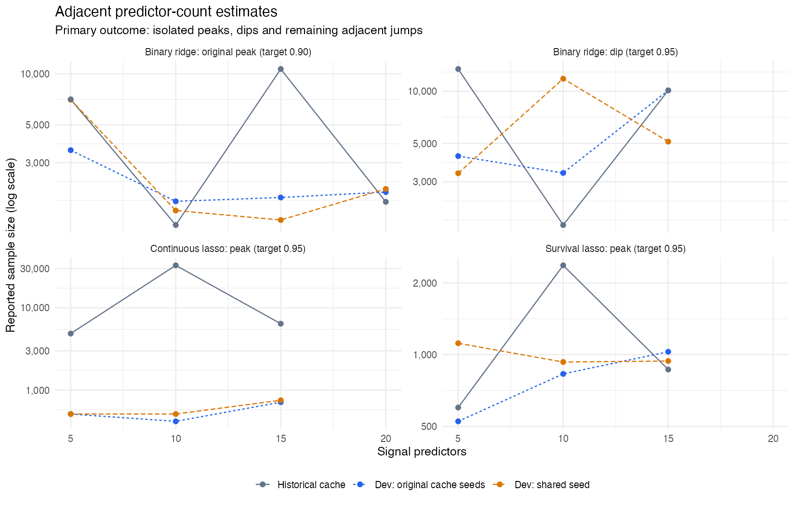
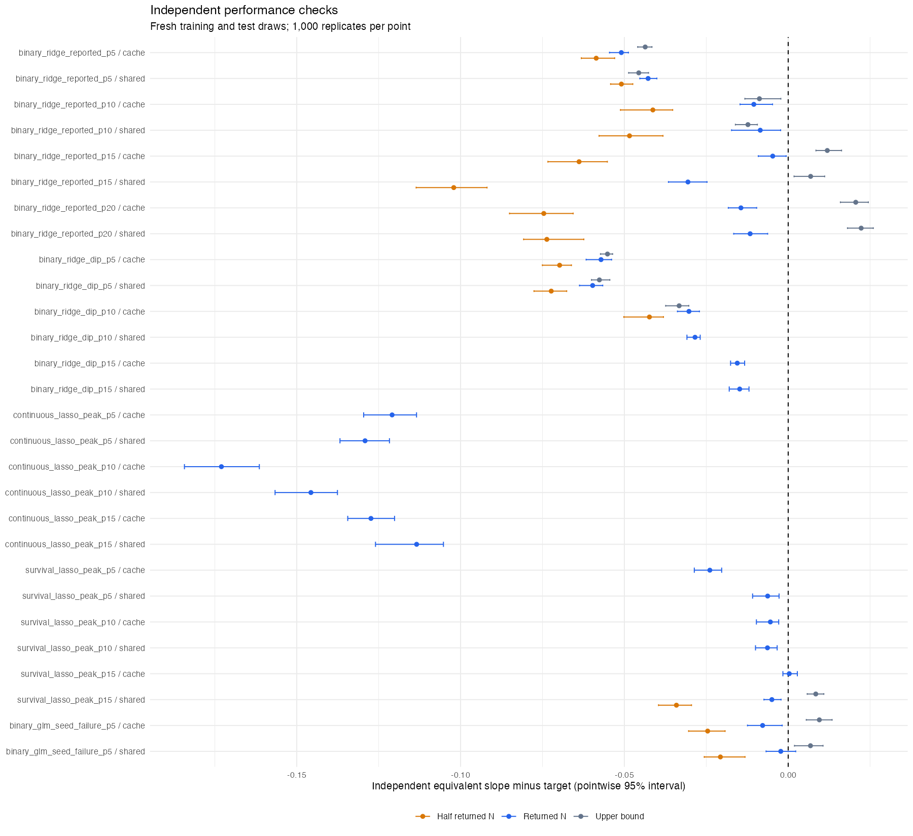

# Ridwan dev stability validation

Tested package: **d00a137640d47a9f1a75482ead8109b1ae1e463d**. Report generated 2026-09-19 09:36:21 UTC.

Ridwan dev removes 6 of 6 historical peak comparisons and 4 of 4 dip comparisons currently assessable; 0 peak/dip comparisons remain unavailable. The primary outcome is the shape of predictor count versus reported minimum sample size. Across both seed schedules, 10 historical isolated peak/dip comparisons no longer meet the same rule and 0 persist. Adjacent-step ratios below identify large jumps that remain despite peak removal.

The study completed 28/28 planned cases; 28 returned numeric sample sizes and 0 returned errors or administrative limits. Four problematic predictor-count slices were tested with original cache seeds and a second shared seed. Each successful search requested 1,000 GP reps; every independent check used 1,000 fresh training/test/model draws.

Of 16 historical >=3x adjacent-step comparisons across the two seed roles, 14 now fall below 3x, 2 remain >=3x, and 0 are unavailable. These counts repeat each historical pair once per new seed role; the study contains nine unique historical adjacent pairs.

The shape improvement is qualified. Both shared-seed ridge curves retain a >3x 5-to-10 step (4.49x and 3.52x); the second ridge slice shifts its large low-N dip toward a high N at ten predictors. All six continuous-lasso searches and all six target-0.95 ridge searches ended on plateaus without an observed above-target upper bound. The continuous-lasso answers cluster at N=417–752, so disappearance of its old 32,768 peak may partly reflect early search termination, not a reliable minimum-N curve. No claim that minimum sample size itself is validated follows from smoothness.

## Isolated peaks and dips: primary outcome

Peaks alone: 6/6 historical peak comparisons are removed, 0 persist, 0 unavailable. Dips: 4/4 are removed, 0 persist, 0 unavailable. There are three distinct historical peaks and two distinct dips, each tested twice.

The historical screen flags an interior point when it differs by at least 3x from the mean of its two neighbours and those neighbours agree within 1.6x. The same rule is applied to the new curves. Five distinct historical positions are each assessed under two seed schedules; a removed dip is also relevant to the same discontinuity problem. This is a descriptive threshold, not a hypothesis test or a monotonicity requirement.

| slice | role | p | historical_kind | cached_deviation | new_left | new_centre | new_right | new_deviation | new_isolated | removed |
| --- | --- | --- | --- | --- | --- | --- | --- | --- | --- | --- |
| binary_ridge_reported | cache | 10 | dip | 6.889 | 3552 | 1776 | 1871 | 1.527 | FALSE | TRUE |
| binary_ridge_reported | shared | 10 | dip | 6.889 | 7042 | 1568 | 1379 | 2.685 | FALSE | TRUE |
| binary_ridge_reported | cache | 15 | peak | 6.993 | 1776 | 1871 | 2013 | 1.013 | FALSE | TRUE |
| binary_ridge_reported | shared | 15 | peak | 6.993 | 1568 | 1379 | 2101 | 1.330 | FALSE | TRUE |
| binary_ridge_dip | cache | 10 | dip | 6.976 | 4222 | 3375 | 10112 | 2.124 | FALSE | TRUE |
| binary_ridge_dip | shared | 10 | dip | 6.976 | 3360 | 11816 | 5118 | 2.787 | FALSE | TRUE |
| continuous_lasso_peak | cache | 10 | peak | 5.819 | 512 | 417 | 713 | 1.469 | FALSE | TRUE |
| continuous_lasso_peak | shared | 10 | peak | 5.819 | 512 | 512 | 752 | 1.234 | FALSE | TRUE |
| survival_lasso_peak | cache | 10 | peak | 3.231 | 525 | 830 | 1028 | 1.069 | FALSE | TRUE |
| survival_lasso_peak | shared | 10 | peak | 3.231 | 1116 | 931 | 940 | 1.104 | FALSE | TRUE |

## Adjacent predictor-count steps

Eight of the nine unique historical predictor-count steps had >=3x jumps. Each is assessed in two new seed roles; these are 16 rerun comparisons of the eight historical jumps, rather than 16 distinct historical pairs.

| slice | role | p_from | p_to | cached_ratio | new_from | new_to | new_ratio | smoothed |
| --- | --- | --- | --- | --- | --- | --- | --- | --- |
| binary_ridge_dip | cache | 5 | 10 | 7.962 | 4222 | 3375 | 1.251 | TRUE |
| binary_ridge_dip | cache | 10 | 15 | 5.991 | 3375 | 10112 | 2.996 | TRUE |
| binary_ridge_reported | cache | 5 | 10 | 5.493 | 3552 | 1776 | 2.000 | TRUE |
| binary_ridge_reported | cache | 10 | 15 | 8.286 | 1776 | 1871 | 1.053 | TRUE |
| binary_ridge_reported | cache | 15 | 20 | 6.050 | 1871 | 2013 | 1.076 | TRUE |
| continuous_lasso_peak | cache | 5 | 10 | 6.741 | 512 | 417 | 1.228 | TRUE |
| continuous_lasso_peak | cache | 10 | 15 | 5.118 | 417 | 713 | 1.710 | TRUE |
| survival_lasso_peak | cache | 5 | 10 | 3.947 | 525 | 830 | 1.581 | TRUE |
| survival_lasso_peak | cache | 10 | 15 | 2.734 | 830 | 1028 | 1.239 | FALSE |
| binary_ridge_dip | shared | 5 | 10 | 7.962 | 3360 | 11816 | 3.517 | FALSE |
| binary_ridge_dip | shared | 10 | 15 | 5.991 | 11816 | 5118 | 2.309 | TRUE |
| binary_ridge_reported | shared | 5 | 10 | 5.493 | 7042 | 1568 | 4.491 | FALSE |
| binary_ridge_reported | shared | 10 | 15 | 8.286 | 1568 | 1379 | 1.137 | TRUE |
| binary_ridge_reported | shared | 15 | 20 | 6.050 | 1379 | 2101 | 1.524 | TRUE |
| continuous_lasso_peak | shared | 5 | 10 | 6.741 | 512 | 512 | 1.000 | TRUE |
| continuous_lasso_peak | shared | 10 | 15 | 5.118 | 512 | 752 | 1.469 | TRUE |
| survival_lasso_peak | shared | 5 | 10 | 3.947 | 1116 | 931 | 1.199 | TRUE |
| survival_lasso_peak | shared | 10 | 15 | 2.734 | 931 | 940 | 1.010 | FALSE |

## Returned sample sizes and secondary target checks

The peak assessment above is the primary verdict. Target attainment is secondary: at returned N, 0/28 checks are above target, 26 below, and 2 overlap (pointwise 95% intervals). Earlier runs also checked half N (14 cases) and the upper bound (14 cases); subsequent runs check returned N only, as recorded in the protocol amendment. These checks do not determine whether a peak has been removed.

| Scenario | Seed | Cache_N | Dev_N | Target | GP_prediction | Independent_slope_95CI | Evidence |
| --- | --- | --- | --- | --- | --- | --- | --- |
| binary_ridge_reported_p5 | cache / 429 | 7075 | 3552 | 0.90 | 0.847 | 0.849 [0.845, 0.851] | below |
| binary_ridge_reported_p5 | shared / 48 | 7075 | 7042 | 0.90 | 0.857 | 0.857 [0.855, 0.860] | below |
| binary_ridge_reported_p10 | cache / 1077 | 1288 | 1776 | 0.90 | 0.899 | 0.890 [0.885, 0.895] | below |
| binary_ridge_reported_p10 | shared / 48 | 1288 | 1568 | 0.90 | 0.899 | 0.891 [0.883, 0.898] | below |
| binary_ridge_reported_p15 | cache / 1725 | 10672 | 1871 | 0.90 | 0.899 | 0.895 [0.891, 0.899] | below |
| binary_ridge_reported_p15 | shared / 48 | 10672 | 1379 | 0.90 | 0.898 | 0.869 [0.863, 0.875] | below |
| binary_ridge_reported_p20 | cache / 2373 | 1764 | 2013 | 0.90 | 0.899 | 0.886 [0.882, 0.890] | below |
| binary_ridge_reported_p20 | shared / 48 | 1764 | 2101 | 0.90 | 0.899 | 0.888 [0.883, 0.894] | below |
| binary_ridge_dip_p5 | cache / 636 | 13440 | 4222 | 0.95 | 0.894 | 0.893 [0.888, 0.896] | below |
| binary_ridge_dip_p5 | shared / 48 | 13440 | 3360 | 0.95 | 0.894 | 0.890 [0.886, 0.893] | below |
| binary_ridge_dip_p10 | cache / 1284 | 1688 | 3375 | 0.95 | 0.921 | 0.920 [0.916, 0.923] | below |
| binary_ridge_dip_p10 | shared / 48 | 1688 | 11816 | 0.95 | 0.925 | 0.922 [0.919, 0.923] | below |
| binary_ridge_dip_p15 | cache / 1932 | 10112 | 10112 | 0.95 | 0.935 | 0.934 [0.932, 0.937] | below |
| binary_ridge_dip_p15 | shared / 48 | 10112 | 5118 | 0.95 | 0.942 | 0.935 [0.932, 0.938] | below |
| continuous_lasso_peak_p5 | cache / 11 | 4861 | 512 | 0.95 | 0.828 | 0.829 [0.820, 0.837] | below |
| continuous_lasso_peak_p5 | shared / 48 | 4861 | 512 | 0.95 | 0.828 | 0.821 [0.813, 0.828] | below |
| continuous_lasso_peak_p10 | cache / 83 | 32768 | 417 | 0.95 | 0.803 | 0.777 [0.766, 0.789] | below |
| continuous_lasso_peak_p10 | shared / 48 | 32768 | 512 | 0.95 | 0.807 | 0.804 [0.793, 0.812] | below |
| continuous_lasso_peak_p15 | cache / 155 | 6402 | 713 | 0.95 | 0.848 | 0.823 [0.816, 0.830] | below |
| continuous_lasso_peak_p15 | shared / 48 | 6402 | 752 | 0.95 | 0.836 | 0.837 [0.824, 0.845] | below |
| survival_lasso_peak_p5 | cache / 47 | 600 | 525 | 0.95 | 0.939 | 0.926 [0.921, 0.930] | below |
| survival_lasso_peak_p5 | shared / 48 | 600 | 1116 | 0.95 | 0.937 | 0.944 [0.939, 0.947] | below |
| survival_lasso_peak_p10 | cache / 695 | 2368 | 830 | 0.95 | 0.950 | 0.945 [0.940, 0.947] | below |
| survival_lasso_peak_p10 | shared / 48 | 2368 | 931 | 0.95 | 0.949 | 0.944 [0.940, 0.947] | below |
| survival_lasso_peak_p15 | cache / 1343 | 866 | 1028 | 0.95 | 0.950 | 0.950 [0.948, 0.953] | overlaps |
| survival_lasso_peak_p15 | shared / 48 | 866 | 940 | 0.95 | 0.950 | 0.945 [0.943, 0.948] | below |
| binary_glm_seed_failure_p5 | cache / 298 | 5120000 | 28282 | 0.95 | 0.950 | 0.942 [0.938, 0.948] | below |
| binary_glm_seed_failure_p5 | shared / 1 | 5120000 | 30198 | 0.95 | 0.949 | 0.948 [0.943, 0.952] | overlaps |

Full bounds, pilot classifications and GP predictions are preserved in results-with-evidence.csv and search-summary.csv.

## Supported smaller points than the historical cache

The prespecified upper-bound checks in these original cache-seed runs are above target at Ns smaller than the old cached Ns. This is positive evidence that a smaller supported alternative is available in the tested version. These upper bounds are validation points, not corrected GP answers or verified minima. Historical environment differences and pointwise interval limitations still apply.

| Scenario | Cache_N | Checked_upper_N | Independent_slope_95CI | Cache_to_checked_ratio |
| --- | --- | --- | --- | --- |
| binary_glm_seed_failure_p5 | 5120000 | 80000 | 0.960 [0.956, 0.963] | 64 |
| binary_ridge_reported_p15 | 10672 | 2668 | 0.912 [0.908, 0.916] | 4 |

## Search errors and bound handoff

(none)

19 estimated cases had no observed above-target classification at their returned upper bound. The detailed stage-1 CSV traces preserve classifications, standard errors, replication counts, failures and stop reasons. An untested fallback bound is not supported merely because it is returned.

## Interpretation and limits

The cache is historical, not a new matched pre-fix run; changes include simulation noise and possible cache-build environment differences. This purposive study covers 14 scenarios and cannot establish a failure rate for all 13,680 cached scenarios or justify clearing all 900 exclusions. Two seeds give a local sensitivity check, not a comprehensive stability distribution.

Ridge/lasso assurance is assessed on the original internal CSSE scale. Displayed equivalent slope is 1-sqrt(-q20(CSSE)); GLM uses raw slope q20. Confidence intervals are binomial order-statistic intervals for individual performance quantiles, not intervals for the minimum N. Overlap is inconclusive. Below is a target shortfall; above at half N establishes an independently tested smaller alternative. Answers have not been corrected.

Independent checks recorded 0 fit errors and 0 nonfinite metric values. Search model observers recorded 0 fitting errors; stage-1 n_fail itself only counts nonfinite values.

The review also reproduced a below-target plateau handing untested bounds to stage 2, an absent RNG stream not being restored, and two existing bisection/hybrid test errors from adaptive_seed forwarding. See [FIXES-AND-PROVENANCE.md](FIXES-AND-PROVENANCE.md), [existing-tests.txt](existing-tests.txt), and [review-diagnostics.csv](review-diagnostics.csv). Those findings are separate from the simulation outcomes.

## Unchanged GP selection rule

The installed mlpwr 1.1.1 selects a final design using an optimistic GP mean + 0.3 standard deviations and a soft cost penalty. It can return a below-target mean; its separate bad-prediction threshold is an absolute discrepancy of 0.4. [GP-REVIEW.md](GP-REVIEW.md), gp-diagnostics.csv and the captured dependency source document this for the saved current runs. This rule explains how below-target predictions can be returned; it does not isolate every independent shortfall.

## Follow-up outside the peak assessment

Broader validation should include more seed schedules around any remaining jump and a fresh matched pre-fix comparison. For the separate target-attainment question, require an independently supported upper bound before handing off to stage 2. A below-target plateau should yield an inconclusive search rather than a claimed sample size. Fresh test draws are needed to address the fixed-test shift; returned GP candidates should receive independent target checks and checks of smaller alternatives. The bisection/hybrid argument-forwarding regressions also need repair. This branch documents those recommendations without changing the package being evaluated.

## Reproduction and consolidated history

See [PROTOCOL.md](PROTOCOL.md), [scenarios.json](scenarios.json), [jobs.json](jobs.json), [search-summary.csv](search-summary.csv), [validation-summary.csv](validation-summary.csv), [adjacent-comparisons.csv](adjacent-comparisons.csv), and [isolated-peaks.csv](isolated-peaks.csv). Run python3 validation/stability-20260918/run-study.py from the repository root, then analyse.R and verify.R. Raw RDS draws remain local; all report summaries and session information are preserved. [EXECUTION.md](EXECUTION.md) records early instrumentation and reporting corrections, which were audited against the saved draws. Historical artifacts are indexed in [history/manifest.json](history/manifest.json).
