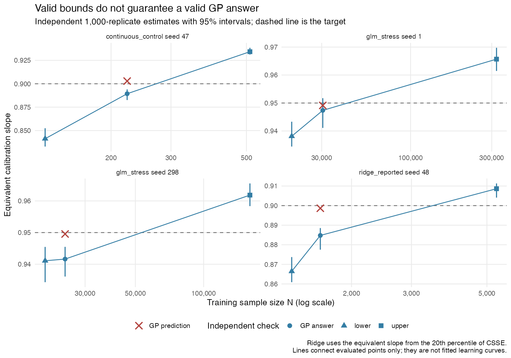

# Local validation of the stage-1 repair

The repair removes the reproduced unsupported-range handoff. It does not make the unchanged GP a verified minimum finder.

Each search requested **1,000 GP reps**; each independent check used **1,000 fresh training/test draws**. The existing adaptive budget remained 500, with 20-replicate batches. No bounds were supplied manually and no GP answer was corrected.

| Case | Adaptive bounds | GP N | Independent equivalent slope [95% CI] | Evidence at GP N |
|---|---:|---:|---:|---|
| glm_stress, seed 1 | 20,000–320,000 | 30,452 | 0.947 [0.941, 0.952] | overlaps target |
| glm_stress, seed 298 | 20,000–160,000 | 24,494 | 0.942 [0.936, 0.945] | below |
| ridge_reported, seed 48 | 1,334–5,336 | 1,619 | 0.885 [0.878, 0.889] | below |
| continuous_control, seed 47 | 128–512 | 223 | 0.889 [0.883, 0.894] | below |

The GLM target is **0.95**; the ridge targets are **0.90**. Ridge searches use CSSE internally: the displayed equivalent slope is `1 - sqrt(-q20(CSSE))`, not the raw slope's 20th percentile. Confidence intervals use binomial order statistics.

Independent checks of the automatic bounds:

- glm_stress, seed 1: lower below; upper above.
- glm_stress, seed 298: lower below; upper above.
- ridge_reported, seed 48: lower below; upper above.
- continuous_control, seed 47: lower below; upper above.

For the original GLM inputs, the prior original-code seed-298 run returned **5,120,000–10,240,000** after a below-target plateau; seed 1 returned **80,000** in its full GP search. The copied [baseline records](baseline/README.md) identify their provenance. The new seed-298 interval allows the GP to search smaller Ns. The original huge GP was not rerun.

A below-target independent interval at a GP answer is a residual stage-2 shortfall, not a successful target check. An overlapping interval is inconclusive; it does not prove attainment or failure. The branch intentionally leaves these answers unchanged, implementing only options 1 and 2.

The existing GP measurements near the seed-298 answer are noisy: at N=24,215, 20 reps gave a slope q20 of 1.002; at N=24,808, 20 reps gave 0.940. The independent 1,000-rep estimate at its reported N=24,494 was 0.942. These nearby Ns are different, so this comparison does not isolate the whole cause of the GP shortfall. The [near-candidate summaries](results/gp-near-candidate.csv) record these observations; `diagnose-gp.R` reproduces them from the locally saved search objects. This study has not established that changing the GP architecture is necessary, or validated alternative settings.

This four-case study supports the identified stage-1 repair and exposes its practical limits. It does not establish general target attainment, the true minimum, simultaneous coverage of the adaptively inspected intervals, or reliability on all models, outcomes and seeds. Plateau stopping can still be premature, but it now reports an inconclusive search instead of inventing bounds or claiming unreachability.

Actual GP counts: glm_stress seed 1 = 1000; glm_stress seed 298 = 1000; ridge_reported seed 48 = 1000; continuous_control seed 47 = 1004. Small budget overshoots come from existing library batching.

Scripts, CSV traces, summaries and per-case session information accompany this note; raw RDS draws remain locally available. Reproduce the runs using [README.md](README.md), then run `Rscript validation/adaptive-stage1/make-report.R`.

Package verification: the full test suite passed (one optional-dependency skip); `R CMD check --no-manual --no-build-vignettes --ignore-vignettes` returned **Status: OK**. Manuals and vignettes were excluded from that check.
