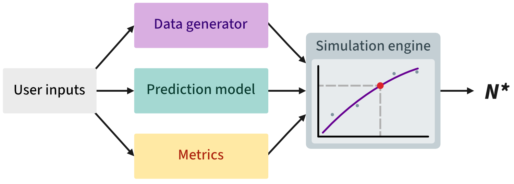

```{r}
#| label: setup
#| include: false
knitr::opts_chunk$set(
  collapse = TRUE,
  comment = "#>",
  fig.width = 6, fig.height = 4,
  warning = FALSE,
  message = FALSE
)
vignette_cache_dir <- file.path(dirname(knitr::current_input(dir = TRUE)), "cache")
if (!dir.exists(vignette_cache_dir)) {
  stop("Could not locate vignette cache directory: ", vignette_cache_dir)
}
```

## What pmsims does

**pmsims** estimates the **minimum sample size** needed to develop a
prediction model to achieve a target level of performance **with
assurance**. Rather than relying on simple rules of thumb or closed‑form
formulae, pmsims uses **simulation** to:

-   Generate synthetic datasets that reflect your target setting
    (outcome type, prevalence or $R^2$, signal vs. noise predictors);
-   Fit a specified **model** (e.g., logistic regression or linear
    regression);
-   Evaluate a chosen **performance metric** (e.g., calibration slope,
    AUC); and
-   Trace a **learning curve** of performance as the training size
    increases.

<p align="center">
  
</p>

The recommended design objective is **assurance**: the **smallest** $n$
such that a high proportion of repeated studies (e.g., 80%) meet the
target performance. In pmsims, this is implemented via the **20th
percentile** of the simulated performance distribution at each $n$.

## Required inputs at a glance

There are three wrapper functions for binary, continuous, and survival
outcomes, respectively:

- `simulate_binary()`
- `simulate_continuous()`
- `simulate_survival()`

All three functions share the same basic structure. The table below
lists the key inputs.

```{=html}
<style>
/* Compact, readable argument table */
.arg-filter {
  display: flex;
  align-items: center;
  gap: 12px;
  margin: 0 0 14px 0;
  flex-wrap: wrap;
}
.arg-filter__label {
  font-size: 0.95rem;
  font-weight: 600;
}
.arg-filter__tabs {
  display: inline-flex;
  gap: 6px;
  flex-wrap: wrap;
}
.arg-filter__tab {
  appearance: none;
  border: 1px solid #d8d8e0;
  background: #fff;
  color: #444;
  border-radius: 999px;
  padding: 6px 12px;
  font-size: 0.92rem;
  line-height: 1.2;
  cursor: pointer;
  transition: background 0.15s ease, border-color 0.15s ease, color 0.15s ease;
}
.arg-filter__tab:hover {
  border-color: #bfc6d4;
  background: #f7f9fc;
}
.arg-filter__tab.is-active {
  background: #1f4b99;
  border-color: #1f4b99;
  color: #fff;
}
.arg-table {
  width: 100%;
  border-collapse: collapse;
  table-layout: auto;
  font-size: 0.95rem;
}
.arg-table th, .arg-table td {
  padding: 10px 12px;
  border-bottom: 1px solid #eee;
  vertical-align: top;
}
.arg-table thead th {
  text-align: left;
  border-bottom: 2px solid #ddd;
  position: sticky; top: 0; background: #fff;
}
.arg-table tbody tr:nth-child(even) { background: #fafafa; }
.arg-table code { font-size: 0.95em; }

/* Metadata badges below each description */
.meta { margin-top: 6px; display: flex; flex-wrap: wrap; gap: 6px; }
.badge {
  display: inline-block;
  padding: 2px 8px;
  border-radius: 999px;
  font-size: 0.78rem;
  line-height: 1.4;
  border: 1px solid transparent;
  white-space: nowrap;
}
.badge--scope   { background:#f2f2f7; border-color:#e6e6ee; color:#444; }
.badge--default { background:#eef6ff; border-color:#d6eaff; color:#1b5dab; }
.badge--req     { background:#fdecea; border-color:#f7d6d2; color:#b73b2b; font-weight:600; }

/* On narrow screens, let the description breathe */
@media (max-width: 820px){
  .arg-table th:nth-child(1){ width: 36%; }
}
</style>

<div class="arg-filter">
  <div class="arg-filter__label">Select wrapper</div>
  <div class="arg-filter__tabs" role="tablist" aria-label="Select outcome type">
    <button class="arg-filter__tab is-active" type="button" data-outcome="binary" role="tab" aria-selected="true">
      Binary
    </button>
    <button class="arg-filter__tab" type="button" data-outcome="continuous" role="tab" aria-selected="false">
      Continuous
    </button>
    <button class="arg-filter__tab" type="button" data-outcome="survival" role="tab" aria-selected="false">
      Survival
    </button>
  </div>
</div>

<table class="arg-table">
  <thead>
    <tr>
      <th>Argument</th>
      <th>Description</th>
    </tr>
  </thead>
  <tbody>

    <tr class="arg-row" data-applies="all">
      <td><strong><code>signal_parameters</code></strong></td>
      <td>
        <em>(int)</em> Number of <strong>true signal</strong> predictors associated with the outcome.
        <div class="meta">
          <span class="badge badge--scope">Applies: all</span>
          <span class="badge badge--default">Default: —</span>
          <span class="badge badge--req">Required</span>
        </div>
      </td>
    </tr>

    <tr class="arg-row" data-applies="all">
      <td><code>noise_parameters</code></td>
      <td>
        <em>(int)</em> Number of <strong>noise</strong> predictors unrelated to the outcome.
        <div class="meta">
          <span class="badge badge--scope">Applies: all</span>
          <span class="badge badge--default">Default: <code>0</code></span>
        </div>
      </td>
    </tr>

    <tr class="arg-row" data-applies="all">
      <td><code>predictor_type</code></td>
      <td>
        <em>(chr)</em> Type of simulated predictors (<code>"continuous"</code> or <code>"binary"</code>).
        <div class="meta">
          <span class="badge badge--scope">Applies: all</span>
          <span class="badge badge--default">Default: <code>"continuous"</code></span>
        </div>
      </td>
    </tr>

    <tr class="arg-row" data-applies="all">
      <td><code>binary_predictor_prevalence</code></td>
      <td>
        <em>(num 0–1)</em> Prevalence for binary predictors (used only if <code>predictor_type = "binary"</code>).
        <div class="meta">
          <span class="badge badge--scope">Applies: all</span>
          <span class="badge badge--default">Default: <code>NULL</code></span>
        </div>
      </td>
    </tr>

    <tr class="arg-row" data-applies="binary">
      <td><strong><code>outcome_prevalence</code></strong></td>
      <td>
        <em>(num 0–1)</em> Target prevalence of the binary outcome.
        <div class="meta">
          <span class="badge badge--scope">Applies: binary only</span>
          <span class="badge badge--default">Default: —</span>
          <span class="badge badge--req">Required</span>
        </div>
      </td>
    </tr>

    <tr class="arg-row" data-applies="binary">
      <td><strong><code>maximum_achievable_cstatistic</code></strong></td>
      <td>
        <em>(num 0–1)</em> Maximum achievable <strong>C-statistic</strong> with effectively unlimited data.
        This calibrates the data generator and is not the minimum acceptable threshold.
        <div class="meta">
          <span class="badge badge--scope">Applies: binary only</span>
          <span class="badge badge--default">Default: —</span>
          <span class="badge badge--req">Required</span>
        </div>
      </td>
    </tr>

    <tr class="arg-row" data-applies="continuous">
      <td><strong><code>maximum_achievable_rsquared</code></strong></td>
      <td>
        <em>(num 0–1)</em> Maximum achievable R<sup>2</sup> with effectively unlimited data.
        This calibrates the data generator and is not the minimum acceptable threshold.
        <div class="meta">
          <span class="badge badge--scope">Applies: continuous only</span>
          <span class="badge badge--default">Default: —</span>
          <span class="badge badge--req">Required</span>
        </div>
      </td>
    </tr>

    <tr class="arg-row" data-applies="survival">
      <td><strong><code>maximum_achievable_cindex</code></strong></td>
      <td>
        <em>(num 0–1)</em> Maximum achievable <strong>concordance index</strong> with effectively unlimited data.
        This calibrates the data generator and is not the minimum acceptable threshold.
        <div class="meta">
          <span class="badge badge--scope">Applies: survival only</span>
          <span class="badge badge--default">Default: —</span>
          <span class="badge badge--req">Required</span>
        </div>
      </td>
    </tr>

    <tr class="arg-row" data-applies="survival">
      <td><code>baseline_hazard</code></td>
      <td>
        <em>(num &gt; 0)</em> Baseline hazard used by the survival data-generating mechanism.
        Larger values imply shorter event times, all else equal.
        <div class="meta">
          <span class="badge badge--scope">Applies: survival only</span>
          <span class="badge badge--default">Default: <code>1</code></span>
        </div>
      </td>
    </tr>

    <tr class="arg-row" data-applies="survival">
      <td><strong><code>censoring_rate</code></strong></td>
      <td>
        <em>(num 0–1)</em> Proportion of individuals expected to be censored in the simulated survival datasets.
        <div class="meta">
          <span class="badge badge--scope">Applies: survival only</span>
          <span class="badge badge--default">Default: —</span>
          <span class="badge badge--req">Required</span>
        </div>
      </td>
    </tr>

    <tr class="arg-row" data-applies="all">
      <td><code>model</code></td>
      <td>
        <em>(chr)</em> Model used for fitting (e.g. logistic, linear, or Cox).
        <div class="meta">
          <span class="badge badge--scope">Applies: all</span>
          <span class="badge badge--default">Default: <code>"glm"</code> / <code>"lm"</code> / <code>"coxph"</code></span>
        </div>
      </td>
    </tr>

    <tr class="arg-row" data-applies="all">
      <td><code>metric</code></td>
      <td>
        <em>(chr)</em> <strong>Performance metric</strong> used to estimate the minimum required sample size (e.g. calibration slope, R<sup>2</sup>, C-statistic).
        <div class="meta">
          <span class="badge badge--scope">Applies: all</span>
          <span class="badge badge--default">Default: <code>"calibration_slope"</code></span>
        </div>
      </td>
    </tr>

    <tr class="arg-row" data-applies="all">
      <td><strong><code>target_performance</code></strong></td>
      <td>
        <em>(num)</em> <strong>Minimum acceptable performance</strong> in the units of the chosen metric (e.g. calibration slope ≥ 0.9),
        used as the threshold for selecting the required sample size.
        <div class="meta">
          <span class="badge badge--scope">Applies: all</span>
          <span class="badge badge--default">Default: —</span>
          <span class="badge badge--req">Required</span>
        </div>
      </td>
    </tr>

    <tr class="arg-row" data-applies="all">
      <td><strong><code>n_reps_total</code></strong></td>
      <td>
        <em>(int)</em> Total number of simulation replications.
        <div class="meta">
          <span class="badge badge--scope">Applies: all</span>
          <span class="badge badge--default">Default: <code>1000</code></span>
          <span class="badge badge--req">Required</span>
        </div>
      </td>
    </tr>

    <tr class="arg-row" data-applies="all">
      <td><code>mean_or_assurance</code></td>
      <td>
        <em>(chr)</em> Criterion for summarising results; <code>"assurance"</code> recommended.
        <div class="meta">
          <span class="badge badge--scope">Applies: all</span>
          <span class="badge badge--default">Default: <code>"assurance"</code></span>
        </div>
      </td>
    </tr>

  </tbody>
</table>

<script>
(function() {
  function applyOutcomeFilter(value) {
    document.querySelectorAll(".arg-row").forEach(function(row) {
      var applies = row.getAttribute("data-applies");
      row.hidden = !(applies === "all" || applies === value);
    });
  }

  function setActiveTab(activeTab) {
    document.querySelectorAll(".arg-filter__tab").forEach(function(tab) {
      var isActive = tab === activeTab;
      tab.classList.toggle("is-active", isActive);
      tab.setAttribute("aria-selected", isActive ? "true" : "false");
    });
  }

  function initOutcomeFilter() {
    var tabs = document.querySelectorAll(".arg-filter__tab");
    if (!tabs.length) return;

    tabs.forEach(function(tab) {
      tab.addEventListener("click", function() {
        setActiveTab(tab);
        applyOutcomeFilter(tab.getAttribute("data-outcome"));
      });
    });

    setActiveTab(tabs[0]);
    applyOutcomeFilter(tabs[0].getAttribute("data-outcome"));
  }

  if (document.readyState === "loading") {
    document.addEventListener("DOMContentLoaded", initOutcomeFilter);
  } else {
    initOutcomeFilter();
  }
})();
</script>
```

> Notes:
>
> - `maximum_achievable_*` represents the best plausible performance with
>   effectively unlimited data and calibrates the data generator.
> - `target_performance` is the minimum acceptable performance threshold used
>   to determine the required sample size.
> - For reproducibility, set a random seed (`set.seed()`).

## Installation

```{r}
# install.packages("remotes")
# remotes::install_github("pmsims-package/pmsims")
library(pmsims)
```

## Binary-outcome example

We target the smallest *n* that meets the **assurance** criterion.

```{r}
#| echo: true
#| eval: false
set.seed(123)

binary_example <- simulate_binary(
  signal_parameters = 20,
  noise_parameters  = 0,
  predictor_type = "continuous",
  binary_predictor_prevalence = NULL,
  outcome_prevalence = 0.30,
  maximum_achievable_cstatistic = 0.80,
  model = "glm",
  metric = "calibration_slope",
  target_performance = 0.85,
  n_reps_total = 1000,
  mean_or_assurance = "assurance"
)

binary_example
```

```{r Run binary}
#| echo: false
binary_example <- readRDS(file.path(vignette_cache_dir, "binary.rds"))
print(binary_example)
```


Plot the estimated learning curve and identified sample size:

```{r, fig.alt="Plot showing learning curve for binary outcome"}
plot(binary_example)
```

## Continuous-outcome example

```{r}
#| echo: true
#| eval: false
continuous_example <- simulate_continuous(
  signal_parameters = 15,
  noise_parameters = 0,
  predictor_type = "continuous",
  maximum_achievable_rsquared = 0.50,
  model = "lm",
  metric = "calibration_slope",
  target_performance = 0.90,
  n_reps_total = 1000,
  mean_or_assurance = "assurance"
)

continuous_example
```

```{r}
#| echo: false
continuous_example <- readRDS(file.path(vignette_cache_dir, "continuous.rds"))
print(continuous_example)
```

```{r, fig.alt="Plot showing learning curve for continuous outcome"}
plot(continuous_example)
```

## Session info

```{r}
sessionInfo()
```
